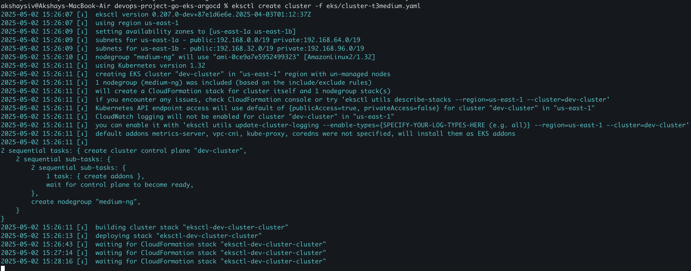
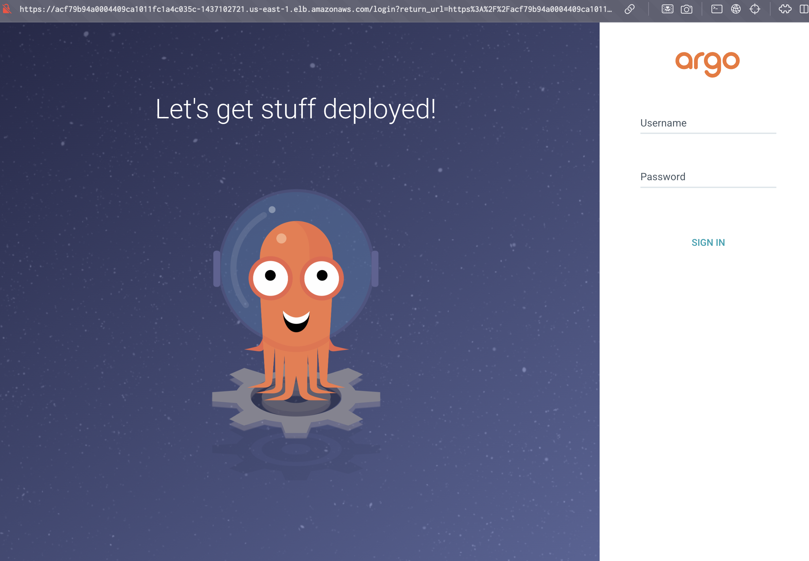
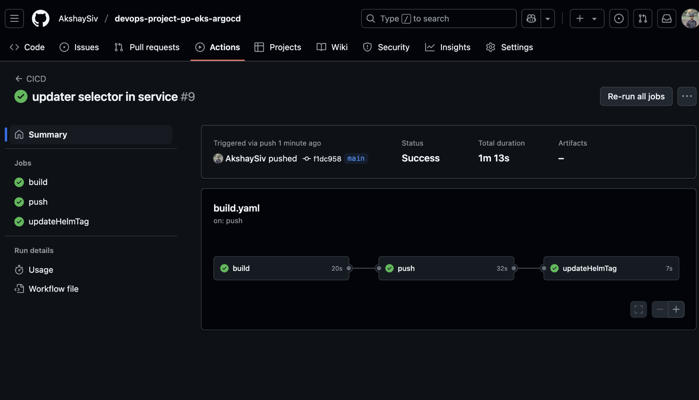
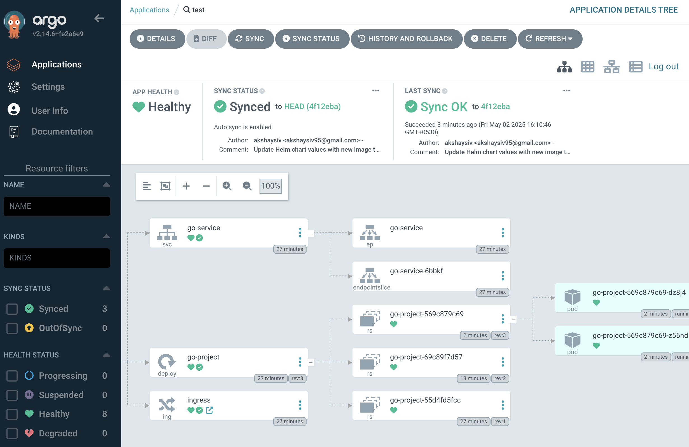
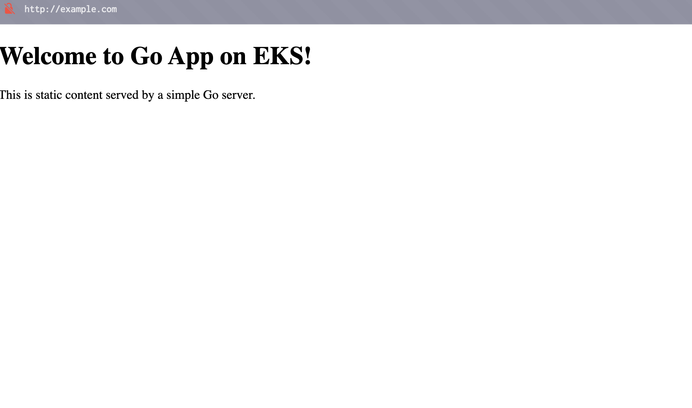

# 🚀 DevOps Project: Using Go EKS ArgoCD Helm

## 🌟 Overview
This project showcases a complete DevOps workflow leveraging **Go**, **Amazon EKS (Elastic Kubernetes Service)**, **ArgoCD**, **Helm Charts**, and **GitHub Actions**. It demonstrates continuous integration and delivery pipelines for deploying a sample Go application.

## ✨ Features
- 🛠️ **Go Application**: A lightweight Go application designed for deployment.
- ☁️ **EKS Integration**: Kubernetes cluster on AWS for scalable container orchestration.
- 🔄 **ArgoCD**: A GitOps-based tool for automated Kubernetes deployments.
- 📦 **Helm Charts**: Simplified Kubernetes application management using Helm.
- ⚙️ **GitHub Actions**: CI/CD pipelines for building, testing, and deploying the application into the EKS cluster.

## Prerequisites
- AWS CLI configured with appropriate permissions.
- kubectl installed and configured.
- Docker installed for containerization.
- Go installed for application development.

## Setup Instructions

### 1. Clone the Repository
```bash
git clone https://github.com/your-username/devops-project-go-eks-argocd.git
cd devops-project-go-eks-argocd
```

### 3. Create EKS Cluster
- Create the EKS cluster using `eksctl`:
```bash
eksctl create cluster -f eks/cluster-t3medium.yaml
```


> **Note**: Before running the command, ensure you have created the IAM role: `arn:aws:iam::<ac>:role/eksClusterRole` and attached the necessary policies for EKS cluster creation. The role should include the following AWS managed policies:
> - `AmazonEKSClusterPolicy`
> - `AmazonEKSServicePolicy`
> - `AmazonEC2ContainerRegistryReadOnly`
> - `AmazonEC2FullAccess`

- Verify the cluster is running:
```bash
kubectl get nodes
```

### 4. Install NGINX Ingress Controller
- Apply the NGINX Ingress Controller manifest:
```bash
kubectl apply -f https://raw.githubusercontent.com/kubernetes/ingress-nginx/controller-v1.12.2/deploy/static/provider/aws/deploy.yaml
```
- Verify the ingress controller pods are running:
```bash
kubectl get pods -n ingress-nginx
```

### 5. Set Up ArgoCD
- Install ArgoCD in your cluster:
```bash
kubectl create namespace go-app
kubectl apply -n argocd -f https://raw.githubusercontent.com/argoproj/argo-cd/stable/manifests/install.yaml
```
---------------------------

### 6. Expose ArgoCD Server
- Update the ArgoCD service to use a LoadBalancer:
```bash
kubectl patch svc argocd-server -n argocd -p '{"spec": {"type": "LoadBalancer"}}'
```
- Wait for the LoadBalancer to be provisioned and get the external IP:
```bash
kubectl get svc -n argocd
```

> **Note**: The LoadBalancer will create a classic load balancer in AWS. Use the external IP or DNS name to access the ArgoCD web interface.

- Default ArgoCD credentials:
    - **Username**: `admin`
    - **Password**: Run the following command to retrieve the initial password:
        ```bash
        kubectl get secret argocd-initial-admin-secret -n argocd -o jsonpath="{.data.password}" | base64 -d
        ```

- Access the ArgoCD UI at `http://<EXTERNAL-IP>` and log in using the credentials above.



### 7. Create an ArgoCD Project for Auto-Sync

- Create a new ArgoCD project to manage the Go application. Save the following YAML configuration as `argo-project.yaml`:

```yaml
apiVersion: argoproj.io/v1alpha1
kind: Application
metadata:
    name: go-app
    namespace: argocd
spec:
    project: default
    source:
        repoURL: 'https://github.com/your-username/devops-project-go-eks-argocd.git'
        targetRevision: HEAD
        path: helm/go-app
    destination:
        server: 'https://kubernetes.default.svc'
        namespace: go-app
    syncPolicy:
        automated:
            prune: true
            selfHeal: true
```

- Apply the configuration to create the project in ArgoCD:
```bash
kubectl apply -f argo-project.yaml
```

- Verify the application is created and synced:
```bash
kubectl get applications -n argocd
```

> **Note**: The `syncPolicy` section enables auto-sync, ensuring that changes in the Git repository are automatically applied to the Kubernetes cluster.


When you push changes to the repository, GitHub Actions will trigger the workflow defined in `.github/workflows`, ensuring the application is built, tested, and deployed automatically.








